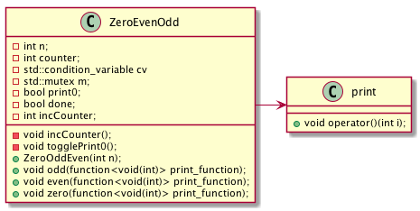

## C++ Conditional Variable 
This repo explores [std::conditional_variable](https://en.cppreference.com/w/cpp/thread/condition_variable) in c++.

## Example Scenario
For a given integer n:
* generate **"0102030...n"**
* _zero_, _even_ and _odd_ numbers are generated by 3 methods of the class _ZeroEvenOdd_
* 3 methods are invoked by 3 threads.

## Design
Class diagram for _ZeroEvenOdd_ is as below:



## Test
```console
make build

make run
```

```console
[==========] Running 1 test from 1 test suite.
[----------] Global test environment set-up.
[----------] 1 test from ZeroEvenOdd
[ RUN      ] ZeroEvenOdd.Positive
[       OK ] ZeroEvenOdd.Positive (1 ms)
[----------] 1 test from ZeroEvenOdd (1 ms total)

[----------] Global test environment tear-down
[==========] 1 test from 1 test suite ran. (1 ms total)
[  PASSED  ] 1 test.
```
