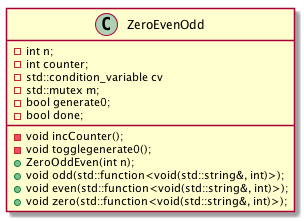

## C++ Conditional Variable 
This repo explores [std::conditional_variable](https://en.cppreference.com/w/cpp/thread/condition_variable) in c++.

## Example Scenario
For a given integer n:
* generate **"0102030...n"**
* _zero_, _even_ and _odd_ numbers are generated by 3 methods of the class _ZeroEvenOdd_
* 3 methods are invoked by 3 threads.

## Design
Class diagram for _ZeroEvenOdd_ is as below:


## Test
```make build```
```make run```
